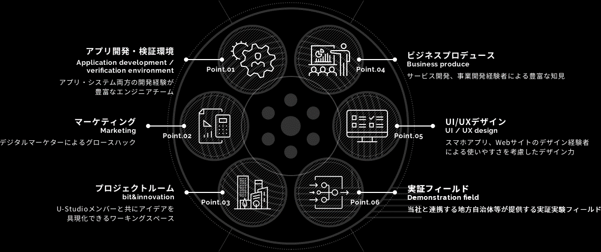
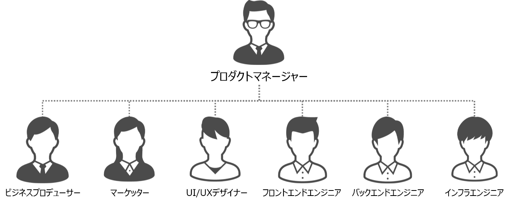
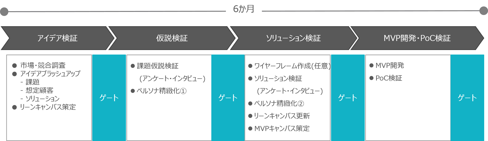
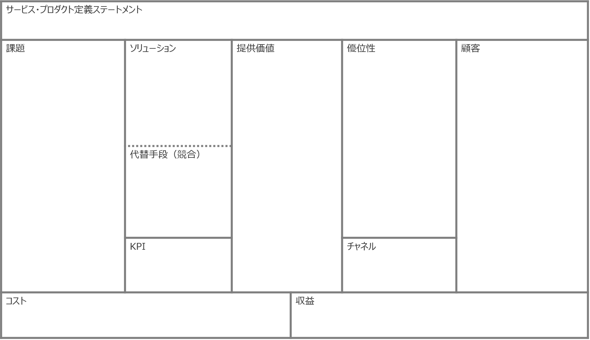
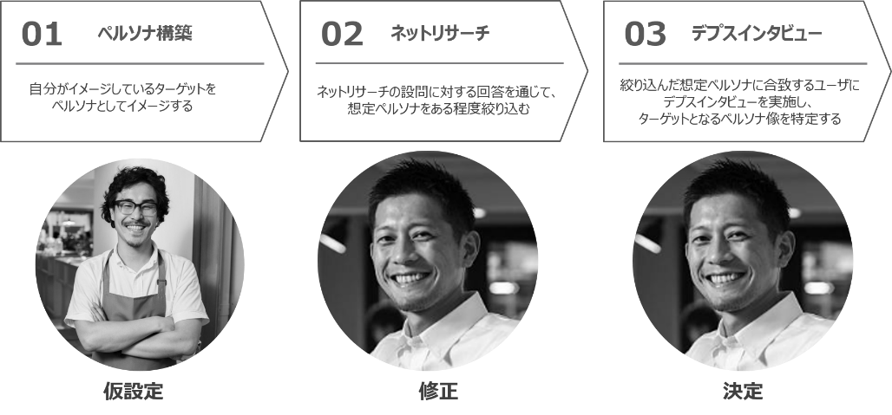
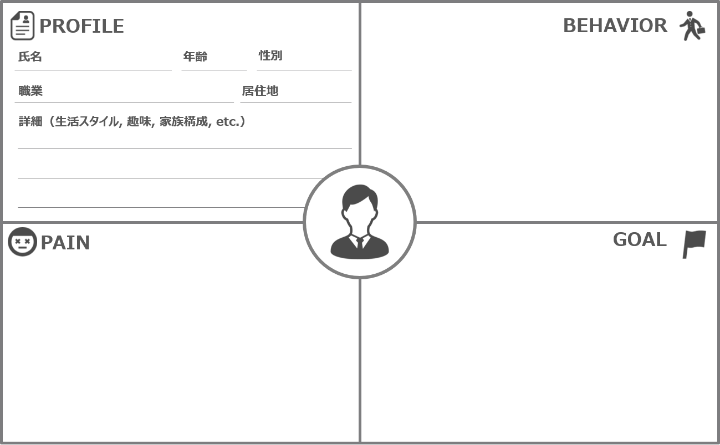
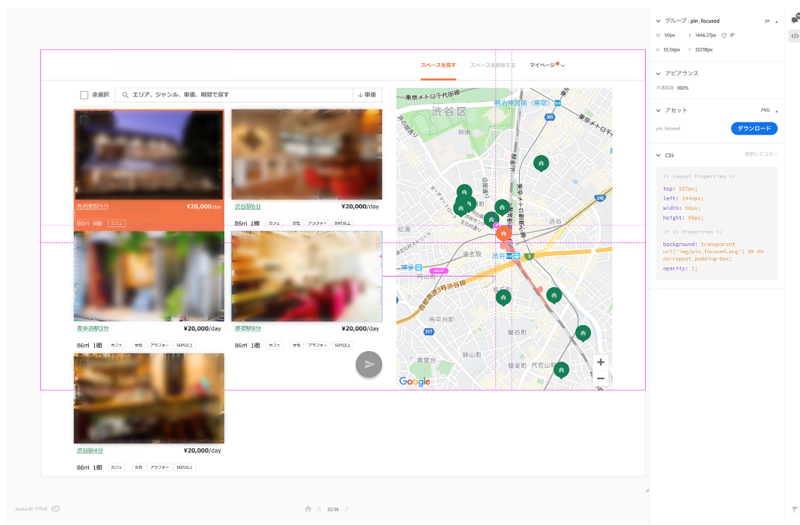
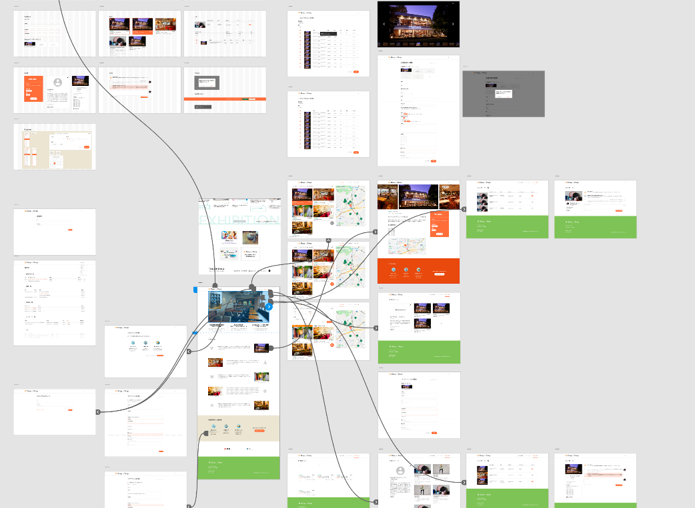
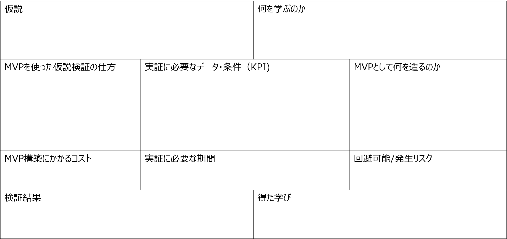
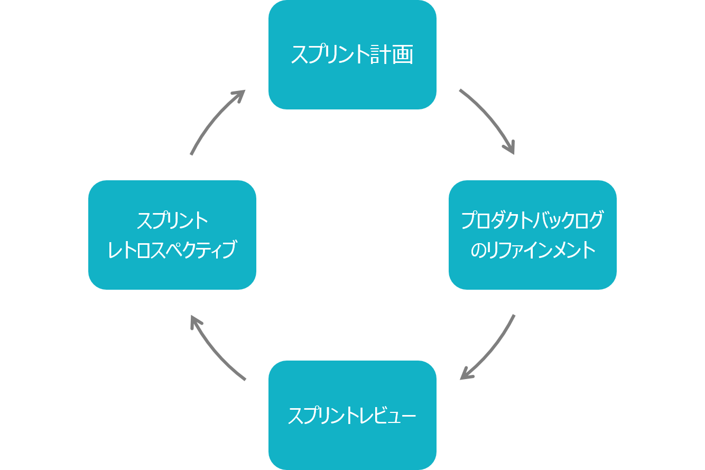

# ステージ・ゲートプロセスに基づく新規事業開発
* [1. はじめに](#1-introduction)
* [2. 定義](#2-definition)
  * [2.1 本文書の対象者](#2-1-target)
  * [2.2 参照文書](#2-2-reference)
  * [2.3 用語定義](#2-3-terms)
* [3. 新規事業開発における各社の役割とプロジェクト体制](#3-roles-and-project-structure)
  * [3.1 各社の役割分担](#3-1-roles)
  * [3.2 当社のチーム構成](#3-2-team)
* [4. 新規事業開発](#4-business-creation)
  * [4.1 ステージ・ゲートプロセス](#4-1-stage-gate-process)
  * [4.2 アイデア検証](#4-2-idea-verification)
  * [4.3 仮説検証](#4-3-testing)
  * [4.4 ソリューション検証](#4-4-solution)
* [5. MVP開発](#5-MVP-development)
  * [5.1 タイムボックス](#5-1-time-box)
  * [5.2 プロダクト・バックログ](#5-2-product-backlog)
  * [5.3 ストーリー書き出し](#5-3-story)
* [6. PoC検証](#6-pocs)
* [7. 事業計画とβ版サービス・プロダクト](#7-business-plan-beta-service-products)
* [8. まとめ](#8-conclusion)

## <a name="1-introduction">1.	はじめに</a>
　近年、社会課題の複雑化、国内市場の成熟、事業ライフサイクル短期化を背景に、急速に進展するデジタル社会に対応するため、各社はこれまで以上のスピードで変化していく必要性に迫られています。このような状況下で、オープンイノベーションによる大企業同士や大企業とスタートアップ企業との新規事業開発、デジタルトランスフォーメーションを検討する企業が増えています。その一方で、それらを推進する不十分な組織体制・機能・プロセス、人材の不足などから、効率よく事業開発を推進できず、成果につながらない企業が多いことが実情です。  
　そこで本文書では、前記課題を鑑み、一層新規事業創出を加速するため、当社がスタートアップ企業や事業会社とオープンイノベーションの枠組みで新規事業開発を行う際のプロセスついて紹介します。なお、本文書に記載の内容は、当社の新規事業開発の実績に応じて改定されます。  

## <a name="2-definition">2. 定義</a>
### <a name="2-1-target">2.1 本文書の対象者
　本文書は、新規事業開発に携わるスタートアップ企業のCXO、事業会社の新規事業企画担当、UI/UXデザイナー、エンジニア、起業を志す学生等を対象としています。  

### <a name="2-2-reference">2.2	参照文書</a>
|番号|文書名|
|------|------|
| [1] | アッティラ・シゲティ, STARTUP STUDIO 連続してイノベーションを生む「ハリウッド型」プロ集団, 日経BP社, 2017.  |
| [2] | エリック・リース・伊藤穣一・井口耕二, リーン・スタートアップ, 日経BP, 2019.  |
| [3] | 田所雅之, 起業の科学 スタートアップサイエンス, 日経BP, 2017.  |

### <a name="2-3-terms">2.3 用語定義</a>
|用語|本書での定義|
|--------------|------|
|Product Market Fit|顧客の課題を満足させる製品（プロダクト、サービス）を提供し、それが適切な市場に受け入れられている状態|
|死の谷|プロダクトの開発・販売を行うための資金や戦略・事業開発、エンジニア、営業、人材などの経営資源を適切に調達できず倒産に至ること|
|Proof of Concept|新たな概念やアイデアの実現可能性を示すために、簡単かつ不完全な実現化を行うこと|
|リーンキャンバス|ビジネスモデルを9つの要素に分けて考えるフレームワーク|
|ペルソナ|サービス・プロダクトを利用する顧客の中で最も重要な人物モデル|
|Minimum Viable Product|初期の顧客を満足させ、将来の製品開発に役立つ有効なフィードバックや実証を得られる機能を備えた製品のバージョンを指す|
|ワイヤーフレーム|Webサイトのレイアウトのイメージを示したもの|
|Adobe XD|アドビシステムズ社が販売しているベクターベースのプロトタイピング作成ツール|
|Adobe Illustrator|アドビシステムズ社が販売しているベクターイメージ編集ソフトウェア|
|MVPキャンバス|仮説検証の内容を明確化するためのフレームワーク|
|ピボット|ビジョンを変えず、プロダクトのチューニングだけでは改善しない場合に行う戦略転換のこと|
|アジャイル|迅速かつ適応的にソフトウェア開発を行う軽量な開発手法群の総称のこと
|スクラム|ソフトウェア開発における反復的で漸進的なアジャイルソフトウェア開発手法の1つ|
|スプリント|1週間や2週間といった、時間枠(タイムボックス)のこと|
|プロダクト・バックログ|機能や技術的改善要素に優先順位を付けて記述したもの|
|フロントエンド|WebサービスやWebアプリケーションなどでユーザがボタンを押したり入力をしたりする部分、またソフトウェアなどと直接やり取りをする部分のこと|
|バックエンド|ユーザが入力した内容などのデータ処理、また保存、データ処理の結果の出力などを行う要素のこと|
|リファインメント|プロダクト・バックログに含まれるアイテムに対して、詳細の追加、見積り、並び替えをすること|

## <a name="3-roles-and-project-structure">3. 新規事業開発における各社の役割とプロジェクト体制</a>
　本章では、新規事業開発の推進におけるスタートアップ企業や事業会社の役割とプロジェクト体制について紹介します。  

### <a name="3-1-roles">3.1 各社の役割分担</a>
　新規事業開発における各社の役割は次のように定義しております。ただし、サービスや事業特性に応じて各社との座組は変化するため、各役割はこの限りではありません。  

  *	スタートアップ企業の役割  
  　アイデアやコア技術・サービスを保有するスタートアップ企業が該当し、本文書「3.2. 当社のチーム構成」に記載する当社チームメンバーと共に、Product Market Fit（以下、PMFという）を実現し、死の谷の回避を目指します。  

  *	事業会社  
  　主に事業会社の新規事業部門が該当し、保有するアイデアやコア技術・サービスを活用し、本文書「3.2. 当社のチーム構成」に記載する当社チームメンバーと共に、オープンイノベーションの実現を目指します。  

  *	当社  
  　イントレプレナーによるサービス・事業創出やスタートアップ企業や事業会社との共創による事業創出を行うにあたり、本文書「3.2 当社のチーム構成」に加え、図 1の機能を有しており、これらを活用することで、新規事業創出を目指します。  

図 1　6つの機能

### <a name="3-2-team">3.2	当社のチーム構成</a>
　スタートアップ企業や事業会社との事業創出にあたり、新たなイノベーション創出モデルとして世界中で注目を集めているスタートアップスタジオ[1]を基に、新規事業開発において必要となる重要なファンクション（資金・人材、事業設計、マーケティング、エンジニア・デザイナー等）を内製化し、事業化プロジェクトとしてチーム一丸で取り組むことにより、実現可能性を高めることを特徴としています。  
　当社では、下記の専任メンバにスタートアップ企業や事業会社が加わり、プロジェクト単位で事業化推進を行います（図 2参照）。  
  *	プロダクトマネージャー：ビジネススキルだけでなく、マーケティングスキルや、UI/UXスキル、基本的なテクノロジー知識を持ち、プロダクト・サービスを管理
  *	ビジネスプロデューサー：事業戦略策定、プロジェクト管理
  *	UI/UXデザイナー：顧客ニーズ検証、顧客体験の創出からプロダクトのデザインの設計を担う
  *	エンジニア：プロダクト開発を行うフロントエンド、バックエンド、インフラ開発を担う
  *	マーケッター：デジタルマーケティングを活用したデータに基づく仮説構築やプロダクトの市場性検証を担う

図 2　当社チーム構成

## <a name="4-business-creation">4. 新規事業開発</a>
　本章では、新規事業開発にあたり、取り入れているステージ・ゲートプロセスとその詳細について紹介します。

### <a name="4-1-stage-gate-process">4.1 ステージ・ゲートプロセス</a>
　当社では、市場トレンドの変化への対応やスタートアップの「死の谷」を回避するため、事業化の見極め期間を6ヵ月と設定しています。この間において、リーン・スタートアップ手法[2][3]やデザイン思考を基に、ステージ・ゲートプロセス（以下、本プロセスという）を導入しており、アイデアのブラッシュアップから想定顧客像の構築、ニーズの仮説構築、ワイヤーフレームを通じた検証、顧客に価値を提供できる最小限のプロダクト開発・実証実験を行います。それぞれのフェーズにゲートを設け、次フェーズに進むレベルに達しているか、有識者を巻き込んだ審議を行うことにより、事業化に向けた精度向上を図っています（図 3参照）。  

図 3　ステージ・ゲートプロセス

　また、概念実証 Proof of Concept（以下、PoCという）の位置付けとして、開発したワイヤーフレームの検証計画と同時に、初期顧客獲得を前提としたテストマーケティング実施計画を立案・実行することで、事業化の見極めだけでなく、今後の顧客獲得拡大に向けた基盤として活用することができます。一方、事業化に至らない場合は、プロジェクト推進により得た知見やアセットがチームに蓄積され、次のプロジェクトに活かすことができる。この好循環を繰り返すことで、プロセス自体が進化し、再現性のある仕組みと成ります。  

　以降、本プロセスの各ステージの詳細について実例を交えて紹介します。なお、一般的な手法やツールの使い方については、関連書籍・文献、関連するWebサイトが多数存在しているため、本文書では割愛します。  

### <a name="4-2-idea-verification">4.2	アイデア検証</a>
　本ステージでは、アイデアを「プランA」という形で関係者と共通認識が得られる段階までのブラッシュアップを行います。主に、共創先および本文書「3.2 当社のチーム構成」に示す、ビジネスプロデューサーとUI/UXデザイナーが担当になります。なお、市場・競合調査方法は、世の中に多々手法が存在するため、詳細は割愛し、本文書では特にリーンキャンバス（図 4参照）を用いたアイデアブラッシュアップについて次に示します。  

図 4　リーンキャンバス

　まず、実現しようとしているサービスやプロダクトを一言で表し、関係者全員の認識を合わせるためのステートメントを定義します。次に、アイデアの特徴に応じてブラッシュアップする項目を選択します。アイデアの特徴としては、市場や顧客課題を起点にする場合と技術シーズやアセットを起点にする場合に分類されます。前者はスタートアップ企業、後者は事業会社との協業に多く見られるパターンになります。  
　市場や顧客課題を起点にする場合は、誰の、どんな課題を解決するのかにフォーカスするため、主に図 4の「課題」「顧客」「提供価値」「ソリューション」の順でアイデアの深堀を実施します。まず、簡易ペルソナを構築し、このペルソナに対し、どんな提供価値を提供することができ、具体的な機能やサービスは何かをリーンキャンバスに記載していきます。一方、技術シーズやアセットを起点にする場合は、技術シードやアセット自体の競合優位性、提供価値、具体的な機能にフォーカスするため、主に図 4の「優位性」「提供価値」「ソリューション」「課題」「顧客」の順でアイデアの深堀を実施します。このソリューションがフィットする、課題、顧客を発見することが本アプローチで重要になります。  
　以降、他の項目を仮説ベースで作成し、作成されたリーンキャンバスを基に、簡易アンケートやインタビューを通じて、課題設定、想定顧客、ソリューションの確度を検証します。ここまでのプロセスを経たリーンキャンバスを関係者全員で共有します。この時点のリーンキャンバスは最終版ではなく、あくまで「プランA」という形になり、ステージが進むにつれ、ブラッシュアップする必要があります。  

### <a name="4-3-testing">4.3	仮説検証</a>
　本ステージでは、本文書「4.2 アイデア検証」で作成したリーンキャンバスに対し、仮説を検証していきます。主に共創先および本文書「3.2 当社のチーム構成」に示す、ビジネスプロデューサーが担当になります。当社では、図 5に記載の流れで想定ターゲットの仮説検証を実施します。  

図 5 想定ターゲットの明確化

　まず、本サービスやプロダクトの顧客となるペルソナ（図 6参照）を作成します。この時点ではあくまで仮説のため、ペルソナは仮設定となります。次に、調査会社を活用し、ペルソナの属性に近いユーザに対し、リーンキャンバス上で記載した提供価値を感じてもらえるのか、またソリューション自体にニーズがあるのか、アンケートである程度絞り込みを行います。当初のペルソナ像と異なる場合は、設定を修正します。次に、そのアンケート結果から、想定顧客候補を抽出し、インタビューを行います。このプロセスを経て、ターゲット顧客を決定が決定するので、リーンキャンバスの「顧客」のアップデートを行います。なお、当社のリサーチの事例は[こちら](https://visasq.co.jp/case/tis-incubation)に掲載されているので、参照ください。  

図 6　ペルソナ

### <a name="4-4-solution">4.4	ソリューション検証</a>
　本ステージでは、Minimum Viable Product（以下、MVPという）開発を行う前に、ワイヤーフレームでイメージを具現化するプロセスについて紹介します。主に本文書「3.2 当社のチーム構成」に示す、UI/UXデザイナーが担当します。  

  1)	デバイス選定  
    　ソリューションの特性に応じて、サービスやプロダクトが動作するデバイスを選定します。大量のデータ入力や分析作業といったデスクワーク中心となる場合はパソコン、日々の生活の中にタッチポイントがあるサービスやプロダクトの場合はスマートフォンが望ましい等、利用シーンを想定した切り口と、本文書「3.2 当社のチーム構成」に示す、エンジニアと共に、MVP開発を想定した機能面も想定した切り口でディスカッションを行い、利用デバイスを選定します。  

  2)	競合サービス・プロダクトのデザインレビュー  
    　本文書「4.2 アイデア検証」で作成したリーンキャンバス（図 4）の代替手段（競合）に記載のサービスやプロダクトデザインを参考にし、優れた点は積極的に取り入れることで、デザインの洗練化に加え、工数の短縮にもつながります。  

  3)	レイアウト選定  
    　画面レイアウトの選定において当社では、Googleが推奨するデザイン手法のガイドライン「マテリアルデザイン」などのレイアウトパターンを活用しています。（図 7参照）。また、デザインの再利用性より、使い勝手の共感にフォーカスすることも選定基準にしています。  

図 7　Material Design（参照元：https://material.io/）

  4)	ワイヤーフレーム制作  
    　ここでは、実際の制作方法については割愛し、当社のプロジェクト推進における制作ツールの条件および使用ツールについて紹介します。まず、ツールの条件を次の通り定義しています。  

      ✓	画面作成のメインとなること（※ベクターデータの埋め込み機能は必須）  
      ✓	ブラウザ経由でワイヤーフレームを共有できること（※ノンデザイナーが専用ソフトウェアのインストールせずに利用可）  
      ✓	作成画面上で共創先および本文書「3.2 当社のチーム構成」に示すビジネスプロデューサーやエンジニアとコメントのやり取りができること（※ツールの一元化）  
      ✓	パーツの書き出しができること（※次のMVP開発フェーズを想定）  

上記の条件を満たすツールとして、当社では、[Adobe XD](https://www.adobe.com/jp/products/xd.html)をメインで使用しています。[Adobe Illustrator](https://www.adobe.com/jp/products/illustrator.html)とベクターデータをコピー＆ペイストで連携することができ、標準的なプロトタイピングツールとしての安定化もあります。実際にAdobe XDを用いて制作したワイヤーフレームを図 8と図 9に示します。  

図 8　Adobe XDによるワイヤーフレーム(1)

 

図 9　Adobe XDによるワイヤーフレーム(2)

5)	レビュー  
  　基本的なデザインレビューは、Adobe XDのコメント機能を用いています。確認と修正を迅速に行えるため、複数のプロジェクトメンバー間でのコミュニケーションロス削減につながります。大方針を決める際は、多面でのレビューを実施しています。  

  　以上の工程を経て制作したワイヤーフレームを介して、明確化されたペルソナに対し、その使いやすさ、課題設定に対するソリューションとして満たしているか、イメージをある程度具現化したワイヤーフレームで検証を行います。  

## <a name="5-MVP-development">5. MVP開発</a>
　本ステージでは、まず本文書「4.4ソリューション検証」で制作したワイヤーフレームに対し、MVPという形でプロダクト化を行います。主に本文書「3.2 当社のチーム構成」に示す、エンジニアが担当します。  

　当社では新規事業開発におけるMVP開発に、アジャイル型開発のスクラムを採用しており、当社が運営する[Fintan](https://fintan.jp/)に掲載の[スプリント運営ガイド](https://fintan.jp/?p=948)に従ってスクラム開発を進行します。  
まず、本文書「3.2 当社のチーム構成」のビジネスプロデューサーと共に、MVPキャンバス（図 10参照）を作成します。MVPキャンバスを用いて、開発スコープおよびPoCで検証したいKPIの認識を合わせます。本内容はPoCの結果を踏まえ、アップデートを繰り返すことにより、PMFを目指します。以降、MVP開発にあたり、[スプリント運営ガイド](https://fintan.jp/?p=948)のうち、要点を示します。  

図 10　MVPキャンバス

### <a name="5-1-time-box">5.1	タイムボックス</a>
　当社では、1スプリントの実施期間を1週間としています。スプリントを短く設定することで、ビジネスアイデアの変化やワイヤーフレーム等のデザインの変化を素早くかつ広く許容することができます。また、当社ではスプリントイベントを図 11の流れで運営しています。  

図 11　スプリントイベント

### <a name="5-2-product-backlog">5.2	プロダクト・バックログ</a>

　本文書「4.4 ソリューション検証」で作成したワイヤーフレームに基づき、フロントエンドにフォーカスしたストーリーを描き出します。MVP開発では、開発と並行して頻繁にデザイン変更が発生するため、次の観点からストーリーを更に細かく分割できるかを検討します。これにより、手戻りのリスクを軽減しています。  

  ✓	アプリケーション画面において、ビジネス上のKPIに関わる部分とそれ以外の部分  
  ✓	UXの観点からデザインの忠実な再現性が必要な部分とそれ以外の部分  
  ✓	サーバサイド（バックエンド）との通信を行う部分  

### <a name="5-3-story">5.3	ストーリー書き出し</a>
　次に、図 10のMVPキャンバスに基づき、KPIを測定するための手法を検討しストーリーを書き出します。書き出したストーリーの優先順位付けは、前記KPIに直結する画面を最優先とし、それ以外の優先度は下げます。その上で開発初期における無駄な機能の実装を避けるため、ビジネスアイデアやワイヤーフレームの変化に影響されにくいストーリーの優先度を上げます。  

　また、スプリントバックログには、本文書「3.2 当社のチーム構成」のエンジニアチームのベロシティに合わせ、各スプリントにストーリーを割り振っていきます。その際の留意点は次の通りです。  

  1.	ワイヤーフレームの計画と照らし合わせてバックログを積む    
    極力、開発メンバーのストーリーと同じスプリントバックログで管理を行います。  
  1.	1スプリントに割り振るフロントエンドとバックエンドおよびインフラのタスク比率/比重を注視  
    限られたエンジニアリソースで実施する場合、スキルセットに偏りがあるケースが多く、短期間で無理なく成果をあげるために、チームのボトルネックとなりやすい領域を早期に発見し修正し易くします。  

　最後に、プロダクト・バックログのリファインメントとして、次、次々スプリントのストーリーについてリファインメント（精錬）を行います。[スプリント運営ガイド](https://fintan.jp/?p=948)の手順と合わせ、最重要指標（OMTM）やその他KPI、指標を満たすことができるか、MVPキャンバスを満たす最適なストーリーかといったMVP特有の観点をチェックしていきます。  

## <a name="6-pocs">6. PoC検証</a>
　本文書「4.3 仮説検証」を通じて設定した想定ターゲットに対し、本文書「5 MVP開発」のMVPをα版のサービスまたはプロダクトとして、市場に受け入れられるのか検証を行います。その指標として、当社では本文書「5 MVP開発」で作成したMVPキャンバスを用いています。また、並行してMVP運用日時、障害受付日時、保守作業スケジュール、障害報告と対応方法、状態監視と監視項目、ヘルプのサポート時間・問合せ窓口といったMVPとしてのサービスレベルを設定します。これにより、ステークホルダーの期待値を見える化・コントロールが可能になります。PoCの結果に応じて、次のステージに進むか、ピボットするかを判断します。  

## <a name="7-business-plan-beta-service-products">7.	事業計画とβ版サービス・プロダクト</a>
　本文書「6 PoC検証」で次のステージへの移行と判断された場合、当社では事業計画を策定し投資委員会に上程します。承認が得られれば、システム開発、マーケティング等、必要なリソースをアサインし、サービスまたはプロダクトのβ版ローンチに向けた開発推進を行います。β版ローンチ後、正式版サービスをローンチするかは、事業計画承認時のクライテリアに基づき、判断を行います。  

## <a name="8-conclusion">8. まとめ</a>
　当社がスタートアップ企業や事業会社とオープンイノベーションの枠組みで新規事業開発を行う際のプロセスについて紹介してきました。本文書が社会課題の解決に少しでも役立つことを願っています。  

